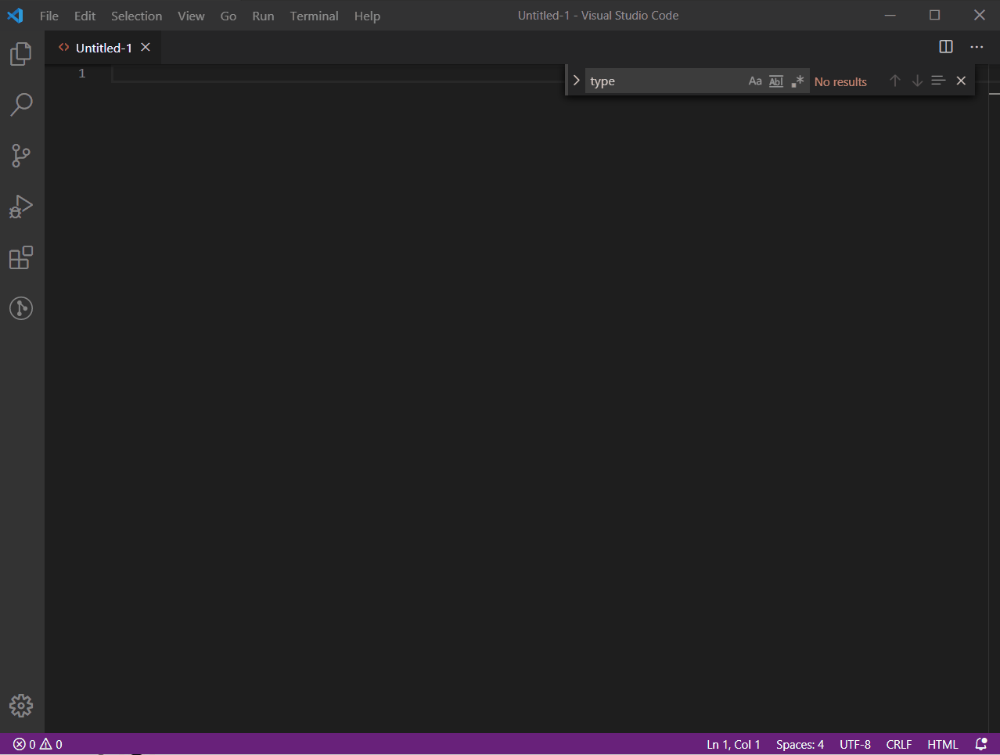

# qidgenerator README

* open the html file. 
* Ctrl + Shift + p, 
* then select 'Add QID To current file 🙈🙉🙊'.
* Enter the qid prefix i.e for qid="dashboard-1" enter 'dashboard'
* The extension will add qid to all anchors, button and input elements in opened html.

